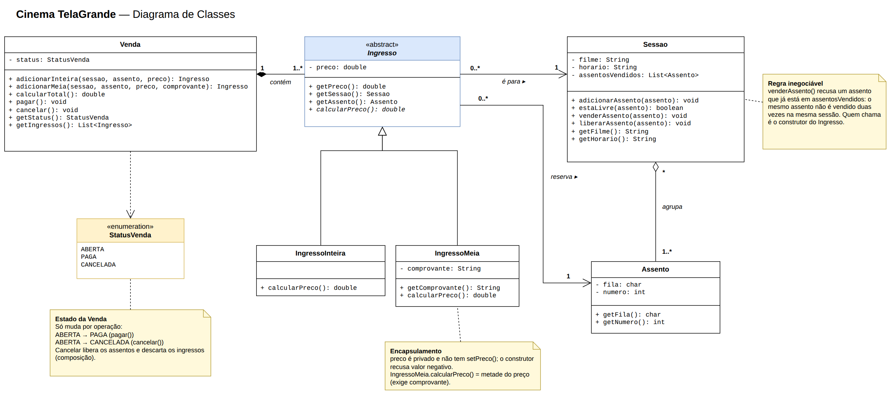
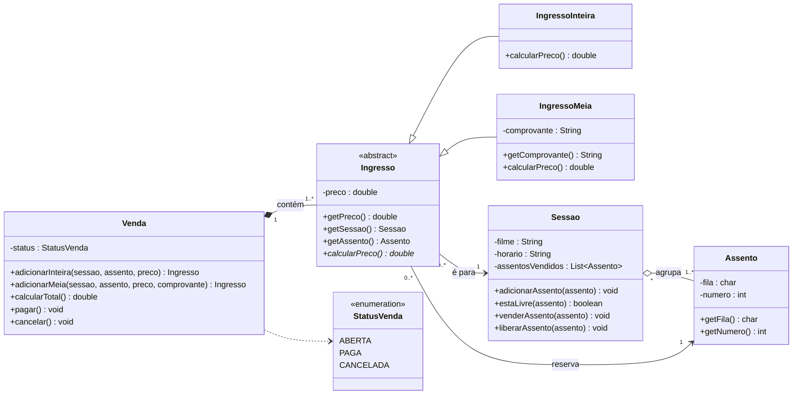

# Cinema TelaGrande: sessões e ingressos

> **Sobre o projeto.** Sistema de venda de ingressos do cinema **TelaGrande**. O cliente vende
> **ingressos** por **assento** em cada **sessão** e tem uma regra que não pode falhar: **o mesmo
> assento não pode ser vendido duas vezes na mesma sessão**. Existem dois tipos de ingresso,
> **inteira** e **meia-entrada** (metade do preço, exige comprovação), e a **venda** passa pelos
> estados *aberta → paga* ou *aberta → cancelada*.
>
> Este repositório traz, na ordem: **entrevista → classes → diagrama de classes (draw.io) →
> código Java → saída testada**.

| Item | Onde está |
|------|-----------|
| Diagrama de classes (draw.io) | [`modelagem/diagrama-de-classes.drawio`](modelagem/diagrama-de-classes.drawio) |
| Diagrama em imagem | [`modelagem/diagrama-de-classes.png`](modelagem/diagrama-de-classes.png) |
| Código-fonte Java | [`java/`](java/) |

---

## 1. A entrevista 

A entrevista completa é a `EntrevistaTecnica` do projeto 15. Os pontos que viraram modelo foram:

- **Cliente:** a peça central é o **Ingresso**. Tem **IngressoInteira** (o comum) e **IngressoMeia**
  (custa metade e exige comprovação). Todos têm **assento** e **preço**.
- **Cliente:** o `calcularPreco()` muda por tipo: inteira = preço inteiro; meia = metade.
- **Analista de qualidade:** o **preço** não pode ser mexido por fora (nunca negativo), e **não pode
  vender o mesmo assento duas vezes na mesma sessão**. O estado da **Venda** só anda por operações
  (aberta → paga; ou cancelada).
- **Cliente:** uma sessão tem **muitos** assentos; cada ingresso reserva **um** assento de **uma** sessão.
- **Cliente:** **Venda ◆ Ingresso**: o ingresso pertence à venda e some junto se ela for cancelada.
- **Dev sênior:** **Sessao ◇ Assento**: os assentos existem na sala por conta própria; a sessão só os agrupa.

---

## 2. Passo 1: Da entrevista às classes

| Na fala apareceu… | Vira no modelo |
|-------------------|----------------|
| "ingresso" (inteira / meia) | classe **`Ingresso`** (abstrata) → `IngressoInteira`, `IngressoMeia` |
| "todos têm assento e preço" | atributo `preco` + ligações com `Assento` e `Sessao` |
| "`calcularPreco()` muda por tipo" | operação **polimórfica** `calcularPreco()` |
| "meia exige comprovação" | atributo `comprovante` em `IngressoMeia` |
| "preço não pode ser mexido por fora" | `preco` **privado**, sem `setPreco()`, validado no construtor |
| "não vender o mesmo assento duas vezes" | **invariante** protegido por `Sessao.venderAssento()` |
| "venda: aberta → paga / cancelada" | `Venda` com `status` (`StatusVenda`) e operações `pagar()` / `cancelar()` |
| "ingresso some junto com a venda" | **composição** `Venda ◆ Ingresso` |
| "sessão agrupa assentos que existem sozinhos" | **agregação** `Sessao ◇ Assento` |
| "cada ingresso reserva um assento de uma sessão" | **associações** `Ingresso → Sessao` e `Ingresso → Assento` |

**Decisões tomadas (lacunas da entrevista):**

- `filme` e `horario` ficaram como texto dentro de `Sessao`. A entrevista não pede classes `Filme` ou `Sala`.
- A regra do assento fica na **`Sessao`**, porque é ela que sabe quais assentos já foram vendidos *nela*.
- Ao **cancelar** a venda, os assentos voltam a ficar livres. Se os ingressos somem, a reserva do assento também deve sumir.

---

## 3. Modelagem completa (diagrama de classes)



A mesma modelagem em Mermaid (o GitHub desenha sozinho):



**Como ler:** `«abstract»` + nome em *itálico* = classe abstrata; `*` na operação = método
abstrato; `-` privado, `+` público; `──▷` herança; `◆` composição; `◇` agregação; `-->`
associação; os números são as **multiplicidades**.

---

## 4. Os conceitos no projeto

| Conceito | No Cinema TelaGrande | Onde no código |
|----------|---------------------|----------------|
| **Abstração** | Não existe "um ingresso qualquer": é inteira ou meia | `public abstract class Ingresso` |
| **Herança** | Meia **é um** Ingresso | `IngressoMeia extends Ingresso` |
| **Polimorfismo** | Mesma pergunta, resposta por tipo | `calcularPreco()` com `@Override` em cada tipo |
| **Encapsulamento** | Preço privado, sem setter, nunca negativo | construtor de `Ingresso` |
| **Associação** | Ingresso conhece sua Sessao e seu Assento | atributos `sessao` e `assento` em `Ingresso` |
| **Agregação ◇** | Sessão **recebe** assentos prontos | `Sessao.adicionarAssento(assento)` (sem `new`) |
| **Composição ◆** | Venda **cria** seus ingressos | `new IngressoInteira(...)` **dentro** de `Venda` |
| **Mensagens** | Ingresso pede à sessão para vender o assento | `sessao.venderAssento(assento)` |
| **Invariante** | Um assento vendido nunca é vendido de novo na mesma sessão | `Sessao.venderAssento()` |

> **A diferença entre ◇ e ◆ no código é quem faz o `new`.** A `Sessao` **recebe** o `Assento`
> pronto (agregação); a `Venda` **cria** o `Ingresso` lá dentro (composição).

### Pré-condição, pós-condição e invariante (a regra que não pode falhar)

```java
public void venderAssento(Assento assento) {
    // PRÉ-CONDIÇÃO: o assento é desta sessão e ainda está livre
    if (!assentos.contains(assento))
        throw new IllegalArgumentException("Assento " + assento + " não pertence a esta sessão.");
    if (assentosVendidos.contains(assento))
        throw new IllegalStateException("Assento " + assento + " já vendido nesta sessão.");
    assentosVendidos.add(assento);   // PÓS-CONDIÇÃO: agora está vendido (mantém o INVARIANTE)
}
```

### Estado da venda (só anda por operações)

```
ABERTA ──pagar()──▶ PAGA
ABERTA ──cancelar()──▶ CANCELADA   (libera os assentos e descarta os ingressos)
```
Qualquer outra transição (por exemplo, cancelar uma venda já paga) é **recusada** com exceção.

---

## 5. código completo 

> Os arquivos estão em [`java/`](java/), um por classe.


### `Ingresso.java` (abstrata, encapsulamento + mensagem)
```java
public abstract class Ingresso {
    private final Sessao sessao;     // associação
    private final Assento assento;   // associação
    private final double preco;      // dado protegido: não existe setPreco()

    protected Ingresso(Sessao sessao, Assento assento, double preco) {
        if (sessao == null || assento == null)
            throw new IllegalArgumentException("Ingresso precisa de sessão e assento.");
        if (preco < 0)
            throw new IllegalArgumentException("Preço não pode ser negativo: " + preco);
        sessao.venderAssento(assento);   // MENSAGEM (a regra do assento é validada lá dentro)
        this.sessao = sessao;
        this.assento = assento;
        this.preco = preco;
    }

    public double getPreco()    { return preco; }
    public Sessao getSessao()   { return sessao; }
    public Assento getAssento() { return assento; }

    public abstract double calcularPreco();   // polimórfico
}
```

### `IngressoInteira.java` (herança + polimorfismo)
```java
public class IngressoInteira extends Ingresso {
    public IngressoInteira(Sessao sessao, Assento assento, double preco) {
        super(sessao, assento, preco);
    }

    @Override
    public double calcularPreco() { return getPreco(); }   // preço inteiro
}
```

### `IngressoMeia.java` (herança + polimorfismo)
```java
public class IngressoMeia extends Ingresso {
    private final String comprovante;

    public IngressoMeia(Sessao sessao, Assento assento, double preco, String comprovante) {
        super(sessao, assento, preco);
        if (comprovante == null || comprovante.isBlank()) {
            sessao.liberarAssento(assento);   // desfaz a venda do assento feita pelo super(...)
            throw new IllegalArgumentException("Meia-entrada exige comprovação.");
        }
        this.comprovante = comprovante;
    }

    public String getComprovante() { return comprovante; }

    @Override
    public double calcularPreco() { return getPreco() / 2; }   // metade do preço
}
```

### `Assento.java`
```java
public class Assento {
    private final char fila;
    private final int numero;

    public Assento(char fila, int numero) {
        if (!Character.isLetter(fila))
            throw new IllegalArgumentException("Fila deve ser uma letra: " + fila);
        if (numero <= 0)
            throw new IllegalArgumentException("Número do assento deve ser positivo: " + numero);
        this.fila = Character.toUpperCase(fila);
        this.numero = numero;
    }

    public char getFila()  { return fila; }
    public int getNumero() { return numero; }

    @Override
    public String toString() { return "" + fila + numero; }   // ex.: F12
}
```

### `Sessao.java` (agregação ◇ + invariante)
```java
import java.util.ArrayList;
import java.util.List;

public class Sessao {
    private final String filme;
    private final String horario;
    private final List<Assento> assentos = new ArrayList<>();          // AGREGAÇÃO
    private final List<Assento> assentosVendidos = new ArrayList<>();

    public Sessao(String filme, String horario) {
        if (filme == null || filme.isBlank())
            throw new IllegalArgumentException("Filme é obrigatório.");
        if (horario == null || horario.isBlank())
            throw new IllegalArgumentException("Horário é obrigatório.");
        this.filme = filme;
        this.horario = horario;
    }

    public void adicionarAssento(Assento assento) {   // recebe pronto (não cria)
        if (assento != null && !assentos.contains(assento)) assentos.add(assento);
    }

    public boolean estaLivre(Assento assento) {
        return assentos.contains(assento) && !assentosVendidos.contains(assento);
    }

    public void venderAssento(Assento assento) {
        // PRÉ-CONDIÇÃO: o assento é desta sessão e ainda está livre
        if (!assentos.contains(assento))
            throw new IllegalArgumentException("Assento " + assento + " não pertence a esta sessão.");
        if (assentosVendidos.contains(assento))
            throw new IllegalStateException("Assento " + assento + " já vendido nesta sessão.");
        assentosVendidos.add(assento);   // PÓS-CONDIÇÃO: agora está vendido (mantém o INVARIANTE)
    }

    public void liberarAssento(Assento assento) {
        // PRÉ-CONDIÇÃO: só libera o que foi vendido
        if (!assentosVendidos.contains(assento))
            throw new IllegalStateException("Assento " + assento + " não está vendido.");
        assentosVendidos.remove(assento);   // PÓS-CONDIÇÃO: volta a ficar livre
    }

    public String getFilme()   { return filme; }
    public String getHorario() { return horario; }
    public List<Assento> getAssentos() { return List.copyOf(assentos); }
}
```

### `StatusVenda.java` (estados da venda)
```java
public enum StatusVenda {
    ABERTA,
    PAGA,
    CANCELADA
}
```

### `Venda.java` (composição ◆ + estado)
```java
import java.util.ArrayList;
import java.util.List;

public class Venda {
    private final List<Ingresso> ingressos = new ArrayList<>();   // COMPOSIÇÃO
    private StatusVenda status;

    public Venda() {
        this.status = StatusVenda.ABERTA;
    }

    public Ingresso adicionarInteira(Sessao sessao, Assento assento, double preco) {
        verificarAberta();
        Ingresso i = new IngressoInteira(sessao, assento, preco);   // a parte nasce dentro do todo
        ingressos.add(i);
        return i;
    }

    public Ingresso adicionarMeia(Sessao sessao, Assento assento, double preco, String comprovante) {
        verificarAberta();
        Ingresso i = new IngressoMeia(sessao, assento, preco, comprovante);
        ingressos.add(i);
        return i;
    }

    public double calcularTotal() {
        double total = 0;
        for (Ingresso i : ingressos) total += i.calcularPreco();   // MENSAGEM polimórfica
        return total;
    }

    public void pagar() {   // ABERTA -> PAGA
        verificarAberta();
        if (ingressos.isEmpty()) throw new IllegalStateException("Venda sem ingressos não pode ser paga.");
        status = StatusVenda.PAGA;
    }

    public void cancelar() {   // ABERTA -> CANCELADA
        verificarAberta();
        for (Ingresso i : ingressos) i.getSessao().liberarAssento(i.getAssento());   // MENSAGEM
        ingressos.clear();   // composição: os ingressos somem junto com a venda
        status = StatusVenda.CANCELADA;
    }

    private void verificarAberta() {
        if (status != StatusVenda.ABERTA)
            throw new IllegalStateException("Operação não permitida: venda está " + status + ".");
    }

    public StatusVenda getStatus() { return status; }
    public List<Ingresso> getIngressos() { return List.copyOf(ingressos); }
}
```

### `AppCinema.java` (o main que conta a história)
```java
public class AppCinema {
    public static void main(String[] args) {
        // 1) AGREGAÇÃO — os assentos existem na sala; a sessão só os agrupa
        Assento f11 = new Assento('F', 11);
        Assento f12 = new Assento('F', 12);
        Assento f13 = new Assento('F', 13);
        Sessao sessao20h = new Sessao("Duna: Parte Dois", "20:00");
        sessao20h.adicionarAssento(f11);
        sessao20h.adicionarAssento(f12);
        sessao20h.adicionarAssento(f13);
        System.out.println("Sessão '" + sessao20h.getFilme() + "' às " + sessao20h.getHorario()
                + " com " + sessao20h.getAssentos().size() + " assento(s).");

        // 2) COMPOSIÇÃO — a Venda cria os seus ingressos
        Venda venda1 = new Venda();
        Ingresso inteira = venda1.adicionarInteira(sessao20h, f11, 30.0);
        Ingresso meia    = venda1.adicionarMeia(sessao20h, f12, 30.0, "Carteirinha estudante 2026");

        // 3) HERANÇA + POLIMORFISMO — a mesma pergunta, resposta diferente por tipo
        System.out.println("\nIngresso " + inteira.getAssento() + " (inteira): R$ " + inteira.calcularPreco());
        System.out.println("Ingresso " + meia.getAssento() + " (meia):    R$ " + meia.calcularPreco());
        System.out.println("Total da venda: R$ " + venda1.calcularTotal());

        // 4) INVARIANTE — vender o mesmo assento de novo na mesma sessão deve ser recusado
        Venda venda2 = new Venda();
        try {
            venda2.adicionarInteira(sessao20h, f11, 30.0);
        } catch (IllegalStateException e) {
            System.out.println("\nRecusado (invariante): " + e.getMessage());
        }

        // 5) ENCAPSULAMENTO — preço negativo é recusado na entrada
        try {
            venda2.adicionarInteira(sessao20h, f13, -10.0);
        } catch (IllegalArgumentException e) {
            System.out.println("Recusado (encapsulamento): " + e.getMessage());
        }

        // 6) ESTADO DA VENDA — só anda por operações
        venda1.pagar();
        System.out.println("\nVenda 1: " + venda1.getStatus());
        try {
            venda1.cancelar();
        } catch (IllegalStateException e) {
            System.out.println("Recusado (estado): " + e.getMessage());
        }

        // 7) CANCELAMENTO — ingressos somem junto e o assento volta a ficar livre
        venda2.adicionarInteira(sessao20h, f13, 30.0);
        System.out.println("\nF13 livre antes de cancelar? " + sessao20h.estaLivre(f13));
        venda2.cancelar();
        System.out.println("Venda 2: " + venda2.getStatus() + " (" + venda2.getIngressos().size() + " ingresso(s))");
        System.out.println("F13 livre depois de cancelar? " + sessao20h.estaLivre(f13));
    }
}
```

---

## 6. Saída

```
Sessão 'Duna: Parte Dois' às 20:00 com 3 assento(s).

Ingresso F11 (inteira): R$ 30.0
Ingresso F12 (meia):    R$ 15.0
Total da venda: R$ 45.0

Recusado (invariante): Assento F11 já vendido nesta sessão.
Recusado (encapsulamento): Preço não pode ser negativo: -10.0

Venda 1: PAGA
Recusado (estado): Operação não permitida: venda está PAGA.

F13 livre antes de cancelar? false
Venda 2: CANCELADA (0 ingresso(s))
F13 livre depois de cancelar? true
```

---

## 7. Como compilar e rodar

```bash
cd java
javac *.java
java AppCinema
```

---

## 8. Critério de "pronto" (da entrevista)

- [x] Há uma **classe base abstrata** (`Ingresso`) e os dois tipos herdando dela.
- [x] Nenhum atributo sensível está público; o valor (`preco`) e o estado da `Venda` são protegidos.
- [x] A operação `calcularPreco()` aparece na base e é **redefinida** em cada tipo.
- [x] Aparecem os **três** relacionamentos: **associação**, **agregação** (`◇`) e **composição** (`◆`).
- [x] `Venda`→`Ingresso` é **composição** porque o ingresso nasce dentro da venda e some se ela for cancelada; `Sessao`→`Assento` é **agregação** porque o assento é da sala e continua existindo sem a sessão.
- [x] Todas as ligações têm **multiplicidade**.
